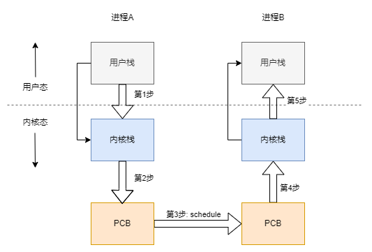
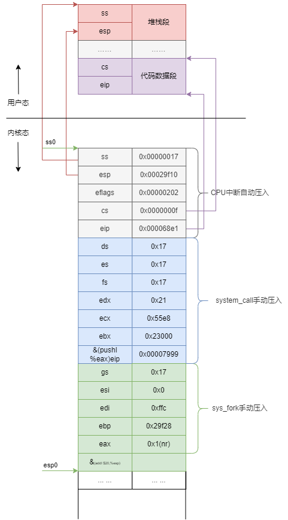
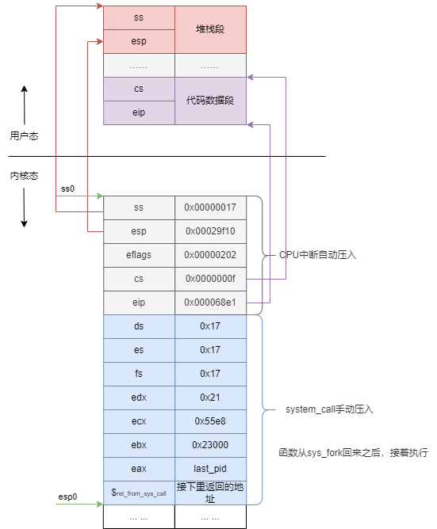

[toc]


# 0. 实验内容

正如实验手册所写：

> 本次实践项目就是将Linux `0.11`中采用的`TSS`切换部分去掉，取而代之的是基于堆栈的切换程序。具体的说，就是将`0.11`中的`switch_to`实现去掉，写成一段基于堆栈切换的代码。
> 本次实践内容如下：本次实验内容如下：

- 编写汇编程序`switch_to`
- 完成主体框架
- 在主体框架下依次完成PCB切换，内核栈切换，LDT切换等
- 修改`fork()`，由于是基于内核栈的切换，所以进程需要创建出能完成内核栈切换的样子
- 修改PCB，即`task_struct`结构，增加相应的内容域，同时处理由于修改了`task_struct`所造成的影响
- 用修改后的`Linux 0.11`仍然可以启动，可以正常运行。
- (选做)分析实验3的日志体会修改前后系统运行的差别

主要完成工作

- 重写 switch_to(kernal/system_call.s)，40%
- 修改现在的fork.c，30%
- 将重写的switch_to与 `schedule()`函数联系在一起，10%
- 实验报告，20%

# 2. 实验结果


# 3. 实验分析

## 何为TSS 切换？

在实验的提示里面，有这一部分内容的讲述，现将其摘录下来，并加入自己的分析。

在0.11系统中，完成进程切换的是靠任务状态段（Task State Segment，简称TSS）的切换来完成的。

具体的说，在设计`Intel`架构（即`x86`系统结构）时，每个任务（进程或线程）都对应一个独立的`TSS`，`TSS`就是内存中的一个结构体如，里面包含了几乎所有的`CPU`寄存器的映像。

```c
struct tss_struct {
	long	back_link;	/* 16 high bits zero */
	long	esp0;
	long	ss0;		/* 16 high bits zero */
	long	esp1;
	long	ss1;		/* 16 high bits zero */
	long	esp2;
	long	ss2;		/* 16 high bits zero */
	long	cr3;
	long	eip;
	long	eflags;
	long	eax,ecx,edx,ebx;
	long	esp;
	long	ebp;
	long	esi;
	long	edi;
	long	es;		/* 16 high bits zero */
	long	cs;		/* 16 high bits zero */
	long	ss;		/* 16 high bits zero */
	long	ds;		/* 16 high bits zero */
	long	fs;		/* 16 high bits zero */
	long	gs;		/* 16 high bits zero */
	long	ldt;		/* 16 high bits zero */
	long	trace_bitmap;	/* bits: trace 0, bitmap 16-31 */
	struct i387_struct i387;
};
```

有一个任务寄存器（Task Register，简称 `TR`）指向当前进程对应的 `TSS` 结构体，所谓的 `TSS` 切换就将 `CPU` 中几乎所有的寄存器都复制到 `TR` 指向的那个 `TSS` 结构体中保存起来，同时找到一个目标 `TSS`，即要切换到的下一个进程对应的 `TSS`，将其中存放的寄存器映像"扣在" `CPU` 上，就完成了执行现场的切换，如下图所示。


`Intel`不仅在硬件设计上提供了这种`TSS`来实现任务切换，同时，在指令上，也提供`ljmp`这样的一条指令就能完成这样的切换。

具体的工作过程如上图所展示的顺序一样：

1. 通过`TR`寄存器中存取的段选择符在`GDT`表中找到当前`TSS`的内存位置，由于 `TSS` 是一个段，所以需要用段表中的一个描述符来表示这个段，和在系统启动时论述的内核代码段是一样的，那个段用 `GDT` 中的某个表项来描述，还记得是哪项吗？是 8 对应的第 1 项，可以通过寄存器进行对应起来即可。（参考小节[**main_track.md - 1.3.1. `sys` 内核堆栈和`task0` 的内核堆栈**]）。此处的 `TSS` 也是用 `GDT` 中的某个表项描述，而 `TR` 寄存器是用来表示这个段用 `GDT` 表中的哪一项来描述，所以 `TR` 和 `CS`、`DS` 等寄存器的功能是完全类似的。找出对应的`TR`寄存器说明。待补充，`GDT`描述。。。
2. 找到了当前的 `TSS` 段（就是一段内存区域）以后，将 `CPU` 中的寄存器映像存放到这段内存区域中，即拍了一个快照。然后更新`CPU`的寄存器到当前`TSS`段里面。
3. 存放完当前进程的`TSS`，接着要找到目标进程的现场，并将其扣在`CPU`上，找目标`TSS`的方法也是一样的，因为找段都要从一个描述符表中找，描述`TSS`的描述符也是放在`GDT`表中，只要给出目标`TSS`段的描述符在`GDT`中存放的位置即可——段选择子。（后面主要阐述这个加载过程）
   1. 仔细想想系统启动时那条著名的 `jmpi 0, 8` 指令，这个段选择子就放在 `ljmp` 的参数中，实际上就 `jmpi 0, 8` 中的 8。这里面的8，就是`0x1000`，对应寄存器来说就是从`GDT`中寻找`gdt[1]`，在下图中的分部代码段部分。
   2. 小思考：系统通过`CR3`找到`GDT`表的位置，通过`TR`能找到当前进程`TSS`在`GDT`中位置，通过`jmpi 0, 8`指令的段选择子及对应的`TSS`的位置。
4. 找到目标`TSS`之后，就将其中的全部寄存器扣在`CPU`上，就相当于切换到目标进程的执行现场了，因为那里有目标进程停下时的 `CS:EIP`，所以此时就开始从目标进程停下时的那个 `CS:EIP` 处开始执行，现在目标进程就变成了当前进程，所以 `TR` 需要修改为目标 `TSS` 段在 `GDT` 表中的段描述符所在的位置，因为 `TR` 总是指向当前 `TSS` 段的段描述符所在的位置。

上面给出的这些，其实都在一个指令里面，长跳转指令 `ljmp 段选择子:段内偏移`，在段选择子指向的段描述符是 `TSS` 段时 `CPU` 解释执行的结果（这一句现在不是很理解🤔），所以基于 `TSS` 进行进程/线程切换的 `switch_to` 实际上就是一句 `ljmp` 指令。

```c
#define FIRST_TSS_ENTRY 4
#define FIRST_LDT_ENTRY (FIRST_TSS_ENTRY+1)
#define _TSS(n) ((((unsigned long) n)<<4)+(FIRST_TSS_ENTRY<<3))
#define _LDT(n) ((((unsigned long) n)<<4)+(FIRST_LDT_ENTRY<<3))

// 这是一段内联汇编
#define switch_to(n) {\
struct {long a,b;} __tmp; \
__asm__("cmpl %%ecx,current\n\t" \
	"je 1f\n\t" \
	"movw %%dx,%1\n\t" \
	"xchgl %%ecx,current\n\t" \
	"ljmp *%0\n\t" \
	"cmpl %%ecx,last_task_used_math\n\t" \
	"jne 1f\n\t" \
	"clts\n" \
	"1:" \
	::"m" (*&__tmp.a),"m" (*&__tmp.b), \
	"d" (_TSS(n)),"c" ((long) task[n])); \
}

// 整体核心简化方式
#define switch_to(n) {
    struct{long a,b;} tmp;
    __asm__(
        "movw %%dx,%1"
        "ljmp %0" ::"m"(*&tmp.a), "m"(*&tmp.b), "d"(TSS(n)
    )
 }
```

结合`GDT`表的结构和整体上的内存分布图，对上面的代码进行分析。`GDT`表中，每一个地址，占8字节，第一个`TSS`项，0号进程的`TSS`，`FIRST_TSS_ENTRY`在`GDT`表中的地4个位置。(`FIRST_TSS_ENTRY`<<3) 4<<3，即 `4 * 8`，相当于`TSS`在`GDT`表中的开始的位置。`_TSS(n)`表示进程n的`TSS`的位置，所以加上((unsigned long) n)<<4)，即 `4 * 16`，举例来说，进程0的`TSS`位置，就是 `0 * 16 + 4 * 8 = 32` 这个位置上，也就是第4个位置；进程1的`TSS`位置，就是 `1 * 16 + 4 * 8 = 48` 对应的`GDT`表中的 `42 / 8 = 6`第6块位置上。 

所以看上面的代码，`"d"(TSS(n)`中，`TSS(n)`拿到的就是进程n的`TSS`选择子，并将这个值加载到`dx`寄存器中，通过`"m"(*&tmp.b)`将其`dx`值放置到`tmp`中32位 `long b`的前16位，现在这个`tmp`结构体中 ，`long a` = 0x0000 0000, `long b` = 0000 (*dx)，对应在`GDT`表中数据来讲，在这8个字节中，`a`表示前4个字节是段内偏移，就是 `jmpi 0, 8` 中的 0；`b`表示后4个字节， `ljmp 段选择子:段内偏移`就是段选择子，实际`switch_to`翻译过来就是，`ljmp 空(long a), n*16+4*8(long b)`。其中，`long b = _TSS(n)`，现在和前面给出的基于`TSS`的进程切换联系在一起了。

同理，`LDT`的位置计算和`TSS`是同样的，不做详解。"m"(*&tmp.b)。


为了更详细的验证这小节，我在【**main_track.md - 1.3.3 . 加载`task0` 后，全局`GDT`表的更新**]】通过gdb打印了这部分的内容，详细可以查看对应小节的具体内存数据，可以更直观地理解这个`GDT`。


## 任务切换从基于TSS的改为基于内核栈切？

正如实验指导里面所说：

>虽然用一条指令就能完成任务切换，但这指令的执行时间却很长，这条 `ljmp` 指令在实现任务切换时大概需要 200 多个时钟周期。而通过堆栈实现任务切换可能要更快，而且采用堆栈的切换还可以使用指令流水的并行优化技术，同时又使得 `CPU` 的设计变得简单。所以无论是 `Linux` 还是 `Windows`，进程/线程的切换都没有使用 `Intel` 提供的这种 `TSS` 切换手段，而都是通过堆栈实现的。
>
>本次实践项目就是将 `Linux 0.11` 中采用的 `TSS` 切换部分去掉，取而代之的是基于堆栈的切换程序。具体的说，就是将 `Linux 0.11` 中的 `switch_to` 实现去掉，写成一段基于堆栈切换的代码。

切换时间长，依赖CPU指令，单一指令无法使能指令流水的并行优化问题。


## 是否还需要任务状态段TSS


## 由特权级引发的中断和异常处理

中断或异常发生的契机，基于中断描述符的寄存器结构来说，里面有对应的段选择子，用于从`GDT`表中可以找到对应任务的`TSS`和`LDT`，从这个寄存器结构里面存储的当前的特权级`CPL[13:14]`，对比要切过去的段选择子里面的`DPL`。

先引入用户态和内核态的本质区别其实是特权级。

1、 `CPL`，我们目前正在执行的代码都是从`cs:eip`这里去取的指令，其中`cs`寄存器就是代码段寄存器 ，里面存储的是段选择子，它的结构我们比较熟悉了，这里的低2位就是对应的当前代码所处的特权级，假如是`0x11`，也就是对应的用户级特权级。

<p align="center">
  
  <br>
  <strong>图1-2</strong>
</p>
2、 `RPL`，假如此时要跳转到另一处内存地址执行，在最终的汇编指令层面也就是对应的`jmp`、`call`和中断。如果是端跳转，就是直接`jmp` `xxx`，这里就不涉及段的变换。也就没有特权级检查。如果是长跳转，就是`jmp` `yyy`：`xxx`，这里的`yyy`就是要跳转到的段选择子的结构。这个结构就是上面的结构一样，`RPL`表示，请求跳转到的段的特权级。

3、`DPL`：长跳转是，从上面的`yyy`对应的结构里面，从`GDT`里面找出对应的段描述符，这个里面的结构有一个`DPL`，表示描述符的优先级。

<p align="center">
  
  <br>
  <strong>图1-3</strong>
</p>


一般地，当`CPL`和`RPL`不等的时候，`CPU`就必须开始使用与新的特权级相关的栈，栈就要发生切换。

## 进程切换五段论

课程上提到，进程切换的五段论，讲述的非常清晰，这里用笔记记录下自己的想法。切换本质上是两套栈（一个进程对应的用户栈和内核栈组成一套栈），相对来说本质上又可以分两个层级，比如A-->B切换的五段，用户栈A-->内核栈A（s1<-->Step1）；内核栈A-->内核栈B（s2,3,4）；内核栈B-->用户栈B（s5）。

<p align="center">
  
  <br>
  <strong>图1-4</strong>
</p>

### 1、从用户栈切换到内核栈，利用中断

整个进程的切换的故事的开始，要从进入内核开始，如何进入内核呢，就是从某个中断开始。参考前面的**Lab2_系统调用章节**。

中断在进入内核时候，`CPU`通过`TR`寄存器找到当前的`TSS`的内存位置，利用里面的`ss0`和`esp0`的值，设置好内核栈（此时内核栈是空的，`esp0`为内核栈的栈顶位置），设置好之后，`CPU`就自动将用户栈的`ss`和`esp` 的值压入栈中，这样就将用户栈和内核栈连接起来，同时，也将 `eflags`, `cs`, `eip`也依次压入到栈中，保存用户态程序的返回地址。用课程里面的话说，这里从一个栈转变成了一套栈，此时在内核栈里面存储的上面这些寄存器是为了后面恢复该进程的用户态所使用，通过`ss:esp`可以找到用户态的堆栈，通过`cs:eip`可以找到用户态的代码段的接着执行的指令。

```
接着，从中断开始指定的`inter gate`的描述符里面去取段选择符和偏移量字段，将其加载到`cs:eip`寄存器，也就是跳转到对应的中断处理程序的第一条指令处去执行。对于系统调用而言，就去调用在`main`函数中`sched_init(void)`初始化时所设置好的中断处理函数`set_system_gate(0x80,&system_call);`，找到其对应的中断处理函数，即`system_call` 函数。
```
```assembly
system_call:
	cmpl $nr_system_calls-1,%eax
	ja bad_sys_call
	push %ds
	push %es
	push %fs
	pushl %edx
	pushl %ecx		# push %ebx,%ecx,%edx as parameters
	pushl %ebx	
	……
	call *sys_call_table(,%eax,4) # sys_fork for current example
	pushl %eax
```

`system_call` 会将`ds`,`es`,`fs`这`3`个数据段寄存器，以及保存了系统调用参数的`edx`,`ecx`,`ebx`压栈。我们先直接从`fork`这个系统调用去追下去。接着，开始执行相应的系统化调用，通过`eax`里面保存的系统调用号`__NR_fork`的值，在`sys_call_table`里面找到对应的`sys_fork`并去执行，既然是函数调用，就需要将调用回来后需要接着执行的下一条指令`pushl %eax`的地址也要入栈。

```assembly
sys_fork:
	call find_empty_process
	testl %eax,%eax
	js 1f
	push %gs
	pushl %esi
	pushl %edi
	pushl %ebp
	pushl %eax
	call copy_process
	addl $20,%esp
1:	ret
```

`sys_fork`先调用 `find_empty_process`为新建进程找到对应的`pid`，并保存在全局变量`last_pid`中。最终返回新的空闲进程的下标`nr`，也就存储在对应的`eax`寄存器里面。回到`sys_fork`后，它又将寄存器`gs`,`esi`,`edi`,`ebp`的值压栈，再将`find_empty_process`的返回值`nr`压栈，并跳转到`copy_process`执行。此时这里又有`call`的调用，就需要将调用回来后的下一条指令`addl $20,%esp`的地址也要入栈。

所以，`CPU`刚进入到**`copy_process`**时候的内核栈是下面这样的，该函数是`fork`里面的主要copy函数，这里的内核栈的进程切换主要修改到这个函数。

<p align="center">
  
  <br>
  <strong>图1-5</strong>
</p>
接着执行`copy_process()`，该函数会传进来很多参数，其实，这里的参数顺序，就是按照上面的栈的顺序进行传递的，想想这里其实是在执行`sys_fork()`，该系统调用的功能就是“叉子”的形状，创建一个和父进程同样的子进程出来。接着分析`copy_process()`的细节。

```c
// 申请内存空间
p = (struct task_struct *) get_free_page(); 

// 创建内核栈，位置放置于一页内存的最顶部位置
p->tss.esp0 = PAGE_SIZE + (long) p;
p->tss.ss0 = 0x10;

// 创建用户栈，由于是fork，子进程和父进程使用同样的用户栈，
// 保证两个进程在用户态时，使用的栈一样，代码一样。
p->tss.esp = esp;
p->tss.ss = ss & 0xffff;

// 将进入中断int 0x80后的下一句的地址，
// 所以，这里两个进程返回后都是从该地址接着执行。
// 多说一句，返回后执行的指令，通过%eap返回值不同，去执行的地方不同。
p->tss.eip = eip;
p->tss.cs = cs & 0xffff;
```


### 2、从内核栈找到PCB，引发schedule

再接着上面的中断进入，分析上面的中断处理函数`system_call`

```assembly
reschedule:
	pushl $ret_from_sys_call
	jmp schedule
system_call:
	cmpl $nr_system_calls-1,%eax
	ja bad_sys_call
	push %ds
	push %es
	push %fs
	pushl %edx
	pushl %ecx		# push %ebx,%ecx,%edx as parameters
	pushl %ebx		# to the system call
	movl $0x10,%edx		# set up ds,es to kernel space
	mov %dx,%ds
	mov %dx,%es
	movl $0x17,%edx		# fs points to local data space
	mov %dx,%fs
	call sys_call_table(,%eax,4)
	pushl %eax
	movl current,%eax
	cmpl $0,state(%eax)		# state
	jne reschedule
	cmpl $0,counter(%eax)		# counter
	je reschedule
ret_from_sys_call:
	movl current,%eax		# task[0] cannot have signals
	popl %eax
3:	popl %eax
	popl %ebx
	popl %ecx
	popl %edx
	pop %fs
	pop %es
	pop %ds
	iret 
```

当从`sys_call_table = sy_fork` 调用返回之后，在函数调用前压入栈里面的`pushl %eax`指令地址被弹出来，接着调用函数前的状态继续执行。将`copy_process`函数返回的值 `last_pid`放入`eax`寄存器内，并且将`eax`进行压栈操作。开始通过当前进程的 `state`判断是否需要调度，若需要调度则去执行`reschedule`函数，先将地址`pushl $ret_from_sys_call`进行入栈操作，开始跳转执行`schedule()`函数。

```c
void schedule(void)
{
	int i,next,c;
	struct task_struct ** p;
    // ……
    switch_to(next);
}
```

C函数的末尾包含`}`相当于`ret`指令，从当前栈里面弹出`$ret_from_sys_call`作为返回地址接着执行，所以`schedule()`返回之后，就去`ret_from_sys_call`这里接着执行了。该函数最后包含了`iret`指令。下面就去接着分析。

下面就是即将进入`schedule()`时，栈里面的情况。

<p align="center">
  
  <br>
  <strong>图1-6</strong>
</p>


### 3、找到下一个进程PCB完成PCB切换，执行switch_to

```c
/*
 *  'schedule()' is the scheduler function. This is GOOD CODE! There
 * probably won't be any reason to change this, as it should work well
 * in all circumstances (ie gives IO-bound processes good response etc).
 * The one thing you might take a look at is the signal-handler code here.
 *
 *   NOTE!!  Task 0 is the 'idle' task, which gets called when no other
 * tasks can run. It can not be killed, and it cannot sleep. The 'state'
 * information in task[0] is never used.
 */
void schedule(void)
{
	int i,next,c;
	struct task_struct ** p;
/* this is the scheduler proper: */
	while (1) {
		c = -1;
		next = 0;
		i = NR_TASKS;
		p = &task[NR_TASKS];
		while (--i) {
			if (!*--p)
				continue;
			if ((*p)->state == TASK_RUNNING && (*p)->counter > c)
				c = (*p)->counter, next = i;
		}
		if (c) break;
		for(p = &LAST_TASK ; p > &FIRST_TASK ; --p)
			if (*p)
				(*p)->counter = ((*p)->counter >> 1) +
						(*p)->priority;
	}
    
	switch_to(next); # 后面需要替换的
}
```

程序里面的`next`就是下一个进程在`task`数组中的下标，通过`next`就可以找到下一个要切换过去的进程。即是通过上面的`switch_to`函数进行`TSS`的切换，参考上面小节【何为`TSS`切换】。

这部分在`schedule`里面进行操作的。也就是这里面引起的`TSS`切换，将当前的`CPU`的寄存器，做个快照，存到当前进程的`TSS`里面，找到目标进程的`TSS`，扣到`CPU`寄存器里面。执行完这里之后，`CPU`现在的寄存器里面的值，已经是目标进程的上下文的值了。在后面第5步骤出栈的时候，应该是目标进程的栈里面进行弹出来的。

这里也是该实验主要修改点，实现我们自己的`switch_to`基于内核栈的进程切换。（为考虑切换流程的完整性，下面内容来自实验指导，加入个人见解）

```assembly
switch_to:
    pushl %ebp # 由于是 C 语言调用汇编，所以需要首先在汇编中处理栈帧，即处理 ebp 寄存器
    movl %esp,%ebp
    pushl %ecx
    pushl %ebx
    pushl %eax
    movl 8(%ebp),%ebx # 取出表示下一个进程PCB的指针
    
    cmpl %ebx,current
    je 1f
! 切换PCB
    ! ...
! TSS中的内核栈指针的重写
    ! ...
! 切换内核栈
    ! ...
! 切换LDT
    ! ...
    movl $0x17,%ecx
    mov %cx,%fs
! 和后面的 clts 配合来处理协处理器，由于和主题关系不大，此处不做论述
    cmpl %eax,last_task_used_math
    jne 1f
    clts

1:    popl %eax
    popl %ebx
    popl %ecx
    popl %ebp
ret
```

一步步分析：其中会有对应的C架构的一些编译问题。

```assembly
pushl %ebp # 由于是 C 语言调用汇编，所以需要首先在汇编中处理栈帧，即处理 ebp 寄存器
movl %esp,%ebp
pushl %ecx
pushl %ebx
pushl %eax
movl 8(%ebp),%ebx # 取出表示下一个进程PCB的指针
```

这里涉及到C里面函数调用的，

```shell
高地址
+------------------+
|  参数n           |
+------------------+
|  ...             |
+------------------+
|  参数2           |
+------------------+
|  参数1           |  <- ESP指向这里（在函数调用前）
+------------------+
|  返回地址        |  <- 调用函数后，EIP压入栈中
+------------------+  <- ESP指向这里（进入函数后）
|  旧EBP值         |  <- pushl %ebp执行后
+------------------+  <- EBP指向这里（movl %esp, %ebp执行后）
|  局部变量        |
+------------------+
低地址
```

* 建立C语言堆栈布局

`ebp`寄存器就是基址指针寄存器，用于指向当前函数的栈帧基地址，所以一个函数开始时，通常会执行`push %wbp`和`movl %esp,%ebp`来建立新的栈帧。将上面的例子中，`schedule()`调用`switch_to()`的时候，就是参数2入栈，参数1入栈，返回地址也就是调用完`switch_to`下一句指令的地址，然后再将`schedule()`的`ebp`入栈，更新`ebp`。所以`movl 8(%ebp),%ebx `取出的就是参数1的位置，即是取出表示下一个进程PCB的指针。请看下面的调用例子形式。

```assembly
; 函数A中
call function_B     ; 执行这条指令时，会将下一条指令的地址压入栈中
movl %eax, %ebx     ; 这是返回地址指向的指令

; function_B中
pushl %ebp          ; 保存旧EBP
movl %esp, %ebp     ; 设置新EBP
; 此时EBP指向旧EBP值的位置
; EBP+4就是返回地址，指向"A中movl %eax, %ebx"这条指令
```

* 切换PCB

```assembly
movl %ebx,%eax # ebx = eax = next
xchgl %eax,current # eax = old_current, current = next =ebx
```

经过这两条指令之后，`eax`指向`old_current`，`ebx = curretn = next`指向下个要切换过去的目标进程。

* TSS指针重写

```assembly
# define
ESP0 = 4，struct tss_struct *tss = &(init_task.task.tss);

movl tss,%ecx # ecx = tss of pnext, it also the new current
addl $4096,%ebx # 将ebx指向next进程最上面的地址了，栈顶
movl %ebx,ESP0(%ecx) # esp0 直接指向next进程的栈顶，就是将栈顶保存到tss里面的esp0进行初始化。
```

在中断的时候，用户栈是怎么找到内核栈的位置？找到内核栈的位置就是依靠TR寄存器指向的当前`TSS`内容，这里面存放着`ss0`和`esp0`寄存器。然后将用户态下面的 `ss:esp，cs:eip`和`eflags`这5个寄存器压到内核栈里面，这是沟通用户栈和内核栈的桥梁。

虽然不使用TSS进行切换了，但是Intel芯片的中断机制依然需要保持，还需要一个全局的TSS，就是0号进程的TSS，所有进程都共用这个TSS，不进行切换，只更改里面寄存器的值。至于`ESP0 = 4`的取值，看对应的`tss`结构体里面该寄存器的位置就一目了然。

* 切换内核栈

完成内核栈的切换就是寄存器`esp`的里面的值的替换，将`CPU`当前寄存器`esp`（内核栈使用到当前情况时的栈顶位置，就是栈向下发展所使用到的位置）的值保存到当前`PCB`中，再从下一个`pnext`的`PCB`对应的保存内核栈栈顶位置取出放入`esp`寄存器内，这样替换之后，等到再使用内核栈时，使用的就是下一个进程的内核栈了。

`PCB`里面需要新增一个内核栈的位置。

```assembly
KERNEL_STACK = 12

movl %esp,KERNEL_STACK(%eax) # 将当前的esp寄存器，保存到old_current进程的PCB的内核栈的位置
movl 8(%ebp),%ebx # 再取一下 ebx，因为前面修改过 ebx 的值
movl KERNEL_STACK(%ebx),%esp # pnext进程的内核栈的位置，赋值到当前esp寄存器里面
```


* 切换LDT

```assembly
 movl 12(%ebp),%ecx # 负责取出对应LDT(next)的那个参数,就是我们传进来的第2个参数
 lldt %cx # 修改LDTR寄存器
```

这里一旦完成修改，下一个进程在执行用户态程序时，使用的映射表就是自己的LDT表了，实现了地址空间的分离。

```assembly
! 切换 LDT 之后
movl $0x17,%ecx
mov %cx,%fs
```

这两句代码的含义是重新去一下段寄存器fs的值，前一个fs指向的是上一个进程的用户态内存，而现在需要执行下一个进程的用户态内存，所以需要这两条指令来重取fs。


### 4、PCB找内核栈

`switch_to()`的最后，就是`ret`指令，也就是拆除上面进入时的`C`语言框架。

```assembly
1:  popl %eax
    popl %ebx
    popl %ecx
    popl %ebp
ret
```

这个ret指令，就会涉及到PC的切换，自然，上面PCB已经完成了切换，剩下的返回的时候，就从切换过来的进程`pnext`,的寄存器里面取出值来。这里也就是对应的进程切换五段论的第4步骤，`PCB`找内核栈。

这个ret背后的事情比较多：`schedule()`函数的最后调用了这个`switch_to()`函数，所执行这句`ret`指令，就会从栈顶弹出返回地址并跳转到该地址，也就是返回到下一个进程（目标进程）的`schedule()`函数的末尾，程序控制权就会回到调用`switch_to`的地方，自然这里遇到的就是`}`。需要注意的就是，在执行完进程切换的时候，虽然物理上是从`switch_to`返回，但由于`current`指针已经被更新指向为新的进程了，所以回来的时候执行环境已经是新进程里面的上下文了。

继续`ret` 回到调用`schedule()`的地方，也就是上面中断处理`sys_call`地方调用的，参考【2、从内核栈找到PCB，引发schedule】，回到中断处理这里，一看，也就是将要到了中断返回`iret`这里。执行`iret`就是到中断返回，这就是目标进程的用户态去执行了。


### 5、内核栈找到用户栈，中断出口

通过`switch_to()`的`ret`指令调用后返回来到`schedule()`，函数末尾，继续执行`}`接着进行返回。在调用完`schedule`返回后，会接着从栈里面弹出`$ret_from_sys_call`的地址，继续执行，这里面一定会包含一个中断返回指令`iret`。可以从内核栈回到用户栈里面。

```assembly
ret_from_sys_call:
	movl current,%eax		# task[0] cannot have signals
	# ……
	popl %eax
	# ……
3:	popl %eax
	popl %ebx
	popl %ecx
	popl %edx
	pop %fs
	pop %es
	pop %ds
	iret 
```

接着，详细看看里面的执行情况。这里出栈的顺序和进入`schedule`前的顺序是一致的。也就是第2步执行完成的时候，栈里面的情况。在执行`iret`之后，对应的和用户栈的寄存器`ss:esp`和`cs:eip`进行弹出，进而跳转到对应的用户态去执行，对于`fork`这个来说，就是中断执行完成的，接着执行的一句。

有个小点需要注意，父进程`fork`结束后，进行返回的时候，参考之前的【一次调用两次返回】小节细节进行查看。分析到这里，返回的这个点也会更加清晰了。

```assembly
#define _syscall0(type,name) \
type name(void) \
{ \
long __res; \
__asm__ volatile ("int $0x80" \
	: "=a" (__res) \
	: "0" (__NR_##name)); \
if (__res >= 0) \
	return (type) __res; \
errno = -__res; \
return -1; \
}
```

## `fork`修改

`fork`的意义就是基于父进程，创建一个新的进程，对于`fork`的修改也就是对子进程的内核栈的初始化，也主要是在`copy_process()`里面将用户态进程的寄存器在这里一并和内核态的对应上。

```assembly
p = (struct task_struct *) get_free_page(); # 申请一页内存作为子进程的`PCB`
krnstack = (long *) (PAGE_SIZE + (long) p); # p上移动一页内存的位置，就是最高处，就是内核栈的位置
```

初始化`krnstack`里面的内容。

```assembly
*(--krnstack) = ss & 0xffff;
*(--krnstack) = esp;
*(--krnstack) = eflags;
*(--krnstack) = cs & 0xffff;
*(--krnstack) = eip; # 这里其实是按照`cpu`中断压入寄存器的顺序
```

接下来，就需要和上面的`switch_to`接在一起考虑了，从它里面切换内核栈完成的那个地方之后，就到子进程内核栈工作了，也就是之前`switch_to`里面的在返回前的下面的这几个`pop`操作，其实所`pop`的内容都属于是子进程的内核栈里的了。

```assembly
1: popl %eax
    popl %ebx
    popl %ecx
    popl %ebp
ret
```

为了能够顺利完成上面的弹栈操作，子进程的内核栈在`fork`出来的时候就应该有这些内容，所以，这里在`fork`里面，就需要把这几个寄存器在栈里面提前放好。

```assembly
*(--krnstack) = ebp;
*(--krnstack) = ecx;
*(--krnstack) = ebx;
// 这里的 0 最有意思。这里其实涉及到fork的返回值，回去执行子进程还是父进程就是这里返回的eax进行判断的。
*(--krnstack) = 0;
```

现在到了`ret`指令了，这条指令要从内核栈中弹出一个32bit数作为EIP的值，跳去执行，这里需要弄一个函数的地址

```assembly
*(--krnstack) = (long) first_return_from_kernel;

first_return_from_kernel:
popl %edx
popl %edi
popl %esi
pop %gs
pop %fs
pop %es
pop %ds
iret
```

`first_return_from_kernel`函数后面的`iret`就是进程切换五段论中的最后一段切换了，通过`iret`完成内核栈到用户栈的切换，当然，需要在切换之前回复一下执行现场，主要就是上面这些寄存器的恢复。

最后，别忘了将存放在`PCB`中的内核栈指针修改到初始化完成时内核栈的栈顶。因为一开始只是使用这个`kernelstack`去一个个位置存放对应寄存器内容，存放完成之后，这个类似指针作用的`kernelstack`还是需要指向栈顶位置的。

```assembly
p->kernelstack = stack;
```

* 结果

这里`fork`完成之后的内核栈的顺序应该是

```shell
+-------------------------+
| SS (用户态栈段)         |
+-------------------------+
| ESP (用户态栈指针)      |
+-------------------------+
| EFLAGS                  |
+-------------------------+
| CS (用户态代码段)       |
+-------------------------+
| EIP (用户态指令指针)    |
+-------------------------+
| DS                      |
+-------------------------+
| ES                      |
+-------------------------+
| FS                      |
+-------------------------+
| GS     <- GS寄存器在此入栈 |
+-------------------------+
| ESI                     |
+-------------------------+
| EDI                     |
+-------------------------+
| EDX                     |
+-------------------------+
| first_return_from_kernel| (switch_to返回地址)
+-------------------------+
| EBP                     |
+-------------------------+
| ECX                     |
+-------------------------+
| EBX                     |
+-------------------------+
| EAX (设置为0)           |
+-------------------------+
```

同时，对应着，当这个新进程，通过`switch_to`被调用完成切换的时候，开始使用该进程的时候，那些从栈里面`pop`的内容就是这里fork时所故意创建的顺序，使用的也就是我们的内核栈`kernelstack`。

# 4、实验报告：
回答下面三个问题：

## 1、理解下面`switch_to`的代码片段

```
movl tss,%ecx
addl $4096,%ebx
movl %ebx,ESP0(%ecx)
```

回答问题：

### 1）为什么要加`4096`？

+4096是需要取栈顶。

### 2）为什么没有设置`tss`中的`ss0`

首先需要明白`ss0`的作用，在`fork`函数里面，我们可以看到所有的进程的`ss0`都被设置为相同的值`0x10`,再去看上面的`GDT`和`LDT`，它就是指向这里面的数据段描述符。

* 内核段时

在内核里面就是GDT里面的内核的数据段描述符。再进一步思考，所有的进程都共享同一个内核地址空间，因此切换到内核里面的时候，所有的进程均使用相同的内核数据段。

* 用户进程时

而且，在每一个进程被`fork`出来的时候，都被初始化为`0x10`的值。

```c
p->tss.ss0 = 0x10;  // 在进程创建时设置，之后不再改变
```

整个`x86`架构中，当发生特权级转换（从用户态到内核态）时，`CPU`会从`TSS`中读取`ss0:esp0`作为内核栈指针，由于所有的进程都共享同一个内核数据段，所以`ss0`是固定的`0x10`，只有`esp0`需要根据不同进程的内核栈进行切换。

上面的这种设计有几个优点：

1. 简化进程切换
2. 性能优化，避免不必要的内存写操作，提高进程切换效率；
3. 统一内核空间：所有进程共享同一个内核地址空间，使用相同的内核数据的段选择子；


## 2、针对代码片段：

```
*(--krnstack) = ebp;
*(--krnstack) = ecx;
*(--krnstack) = ebx;
*(--krnstack) = 0;
```

回答问题：(1) 子进程第一次执行时，`eax=?`为什么要等于这个数？哪里的工作让`eax`等于这样一个数？(2) 这段代码中的`ebx`和`ecx`来自哪里，是什么含义，为什么要通过这些代码将其写到子进程的内核栈中？(3) 这段代码中的`ebp`来自哪里，是什么含义，为什么要做这样的设置？可以不设置吗？为什么？

## 3、为什么需要重新设置fs寄存器

LDT之后要重新设置`fs=0x17`？而且为什么重设操作要出现在切换完LDT之后，出现在LDT之前又会怎么样？


