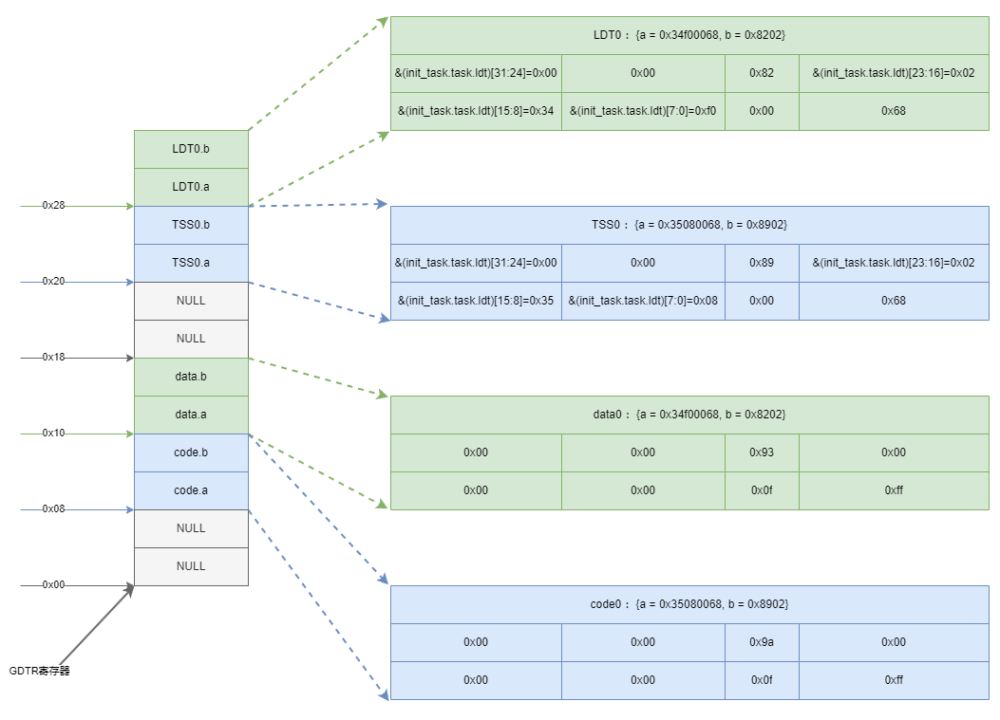
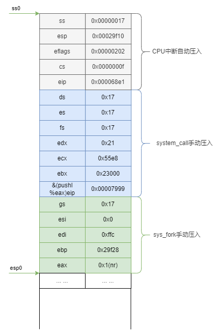
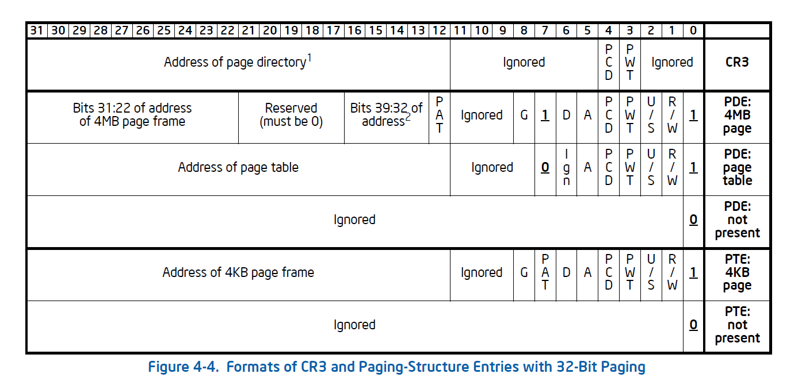

[toc]

<div align="right">
  <a href="README.md">
    
  </a>
</div>

# Linux 0.11 Kernel Source Code Analysis

<div align="center">

**A deep dive into the Linux 0.11 kernel source code**

[](https://github.com/Dargon0123/my_linux_0.11/stargazers)
[](https://github.com/Dargon0123/my_linux_0.11/network/members)
[](https://github.com/Dargon0123/my_linux_0.11/blob/master/LICENSE)

[中文文档](README.md) | [English Document](README_EN.md)

</div>

---

## 📂 Reading Order

| Chapter | Topic | Type | Link |
|---------|-------|------|------|
| L1 | System Boot and Bootloader | Boot | [Lab1_OS_Booting.md](https://github.com/Dargon0123/Linux-0.11/blob/Lab1_OS_Boot/Lab1_OS_Booting.md) |
| L2 | System Call Analysis | Core | [README.md](https://github.com/Dargon0123/Linux-0.11/blob/Lab2_Sys_Call/README.md) |
| L3 | Process Creation Details | Process | [Lab3_Track.md](https://github.com/Dargon0123/my_linux_0.11/blob/3_trace_task/03_process_file/Lab3_Track.md) |
| L4 | Kernel Stack Switching Details | Process | [Code](https://github.com/Dargon0123/my_linux_0.11/tree/3_trace_task) |
| L5 | Memory Management - Paging | Memory | [Code](https://github.com/Dargon0123/my_linux_0.11/tree/3_trace_task) |

> More chapters coming soon...

---

## 0. Questions

After reading this section, you should be familiar with and able to answer the following questions:

1. What is a CPU interrupt?
2. How does copy-on-write relate to page tables?
3. The misconception about `fork` returning twice?

---

## 1. The `main` Function

### 1.0. How to Jump to the `main` Function?

Overview of the general execution process.

The code in `main.c` is executed after the previous completion of `boot/head.s`. The code that needs to be executed after `main` is pushed onto the stack in advance in the `after_page_tables` function. The last item pushed onto the stack is the address of `main`. After the `setup_paging` function returns, the `main` function address is retrieved from the stack and execution begins. Additionally, the four push operations below are the parameters for the `main` function.

```assembly
after_page_tables:
    pushl $0        # These are the parameters to main :-)
    pushl $0
    pushl $0
    pushl $L6       # return address for main, if it decides to.
    pushl $main
    jmp setup_paging
```

### 1.1. Overall Framework of `main`

* **Memory Initialization**: First, functionally divide physical memory for initial memory planning, using `mem_init()` and `buffer_init()` to initialize the main memory area `main_memory` and the `buffer` area.
* **Hardware Initialization**: Then initialize hardware, including `trap` initialization, block devices, character devices, screen print enablement, system time, etc.
* **Task Layer Initialization**: Since we're still in the kernel, manually set up the `task0` context environment, and load the Task State Segment descriptor `TSS0` and Local Descriptor Table `LDT0` into the GDT.
* **Switch to User Mode**: Using a simulated interrupt return mechanism to "deceive" the CPU, switch from kernel mode to user mode `task0`. In `task0`, use the `fork` system call to create child process `task1` (which is `init_task`), and have `task1` continue with the following `init` initialization work.
* **Task0 Execution**: Finally, `task0` does not exit; it executes when the system switches to the idle state. It runs by calling `pause()` to actively sleep, allowing the system to switch to other tasks that need scheduling.

### 1.2. Physical Memory Division and Management

**Division**: Define system memory into 4 areas.

✨ Images to be added

**Management**: Managed through the `mem_map[]` array. Use a large array with map-like properties, assign `map[i] = used` for used areas. This primarily manages the main memory area, `main_memory_start/end`.

### 1.3. `task0` Memory Layout

Task0 is the memory layout corresponding to `init_task` in the `task[]` array, referred to as `task0` throughout. The entire system uses the `task[64]` struct pointer array to describe all information for each running task. The `task_struct` structure describes all contexts of the task, including `pid`, `status`, `fs` information, `ldt`, and `tss` information.

```c
struct task_struct * task[NR_TASKS] = {&(init_task.task), };
```

This includes the process pid, process status, open file descriptors, etc.

Among them, `ldt` and `tss` are two very important members:

```c
/* ldt for this task 0 - zero 1 - cs 2 - ds&ss */
    struct desc_struct ldt[3];
/* tss for this task */
    struct tss_struct tss;
```

* **`TSS` (Task State Segment)**: Stores register information for protecting and restoring process context during task switching. With this register information, task switching can protect and restore process contexts:
  * `cs:eip` - Find current code location
  * `ds, es, fs, gs, esi, edi` - Access data segments
  * `ss:esp` and `ss0:esp0` - Access current process stack and kernel stack
  * `cr3` - Access page directory address
  * `ldt` - Access LDT position in GDT
  * `eax, ebx, ecx, edx, eflags` - General purpose registers

* **`LDT` (Local Descriptor Table)**: Corresponds to the GDT (Global Descriptor Table). Kernel mode code uses data and code segments from GDT; individual task processes use their own local data and code segments from LDT.

Initialize `init_task` state through macro definitions:

```c
#define INIT_TASK \
/* state etc */	{ 0,15,15, \
/* signals */	0,{{},},0, \
/* ec,brk... */	0,0,0,0,0,0, \
/* pid etc.. */	0,-1,0,0,0, \
/* uid etc */	0,0,0,0,0,0, \
/* alarm */	0,0,0,0,0,0, \
/* math */	0, \
/* fs info */	-1,0022,NULL,NULL,NULL,0, \
/* filp */	{NULL,}, \
	{ \
		{0,0}, \
/* ldt */	{0x9f,0xc0fa00}, \
		{0x9f,0xc0f200}, \
	}, \
/*tss*/	{0,PAGE_SIZE+(long)&init_task,0x10,0,0,0,0,(long)&pg_dir,\
	 0,0,0,0,0,0,0,0, \
	 0,0,0x17,0x17,0x17,0x17,0x17,0x17, \
	 _LDT(0),0x80000000, \
		{} \
	}, \
}
```

From the above code, the key register information for `init_task` is organized below:

<p align="center">
  
  <br>
  <strong>Figure 1-1</strong>
</p>

#### 1.3.1. `sys` Kernel Stack and `task0` Kernel Stack

The following figure shows the segment selector descriptor structure for the `cs` register:

<p align="center">
  
  <br>
  <strong>Figure 1-2</strong>
</p>

* **task0 Kernel Stack Area**: From `task[0]`'s `task_struct` element containing `tss`'s `ss0:esp0` information: `ss0=0x10, esp0=PAGE_SIZE+(long)&init_task`. Comparing with the above registers, this is the kernel data segment selector in GDT. Task0's kernel mode stack pointer `esp` is initialized to `PAGE_SIZE+(long)&init_task`, which is 4KB offset from the start of the `task0` structure.

* **sys Kernel Stack Area**: Initialized in `boot/head.s`, this is the system's kernel stack area.

```c
long user_stack [ PAGE_SIZE>>2 ] ;

struct {
	long * a;
	short b;
	} stack_start = { & user_stack [PAGE_SIZE>>2] , 0x10 }; // ss=0x10,esp=& user_stack [PAGE_SIZE>>2]
```

The kernel stack top pointer is at 4KB offset from the `user_stack` array address.

#### 1.3.2. `task0` Linear Address

Through `sched_init()` initialization, load `task0`'s `tss` and `ldt`. `ldt` contains `task0`'s three segments: `{null, code, data}`. The code and data segments correspond to the 64-bit segment descriptor register structure.

<p align="center">
  
  <br>
  <strong>Figure 1-3</strong>
</p>

Let's put the data from Figure 1-1 into the above registers:

**Code Segment `LDT[1] = {0x9f,0xc0fa00}`**

```shell
   63          54 53 52 51 50       48 47 46  44  43    40 39             32
   +-------------+--+--+--+--+--------+--+----+--+--------+----------------+
   | BaseAddress |G |B |0 |A |Seg Lim |P |DPL |S |  TYPE  | BaseAddress    | 
   |   31...24   |  |  |  |V |19...16 |  |    |  | 1|C|R|A|   23...16      |
   |     0x00    |1 |1 |  |L |  0000  |1 |11  |1 | 1|0|1|0|     0x00       |
   +-------------+--+--+--+--+--------+--+----+--+--------+----------------+
   31                               16 15                                  0
   +----------------------------------+------------------------------------+
   |            BaseAddress           |             Segment Limit          |                 
   |             15...0               |                15...0              |
   |             0x0000               |                0x009f              |
   +----------------------------------+------------------------------------+
```

From this, `task0`'s code segment linear address is `BaseAddress = 0x0000 0000`, and the segment limit is `0x009f = 640KB`. The calculation: `(0x9f+1) * 4 = 640KB`.

**Data Segment `LDT[2] = {0x9f,0xc0f200}`**

```shell
   63          54 53 52 51 50       48 47 46  44  43    40 39             32
   +-------------+--+--+--+--+--------+--+----+--+--------+----------------+
   | BaseAddress |G |B |0 |A |Seg Lim |P |DPL |S |  TYPE  | BaseAddress    | 
   |   31...24   |  |  |  |V |19...16 |  |    |  | 0|E|W|A|   23...16      |
   |     0x00    |1 |1 |  |L |  0000  |1 |11  |1 | 0|0|1|0|     0x00       |
   +-------------+--+--+--+--+--------+--+----+--+--------+----------------+
   31                               17 16                                  0
   +----------------------------------+------------------------------------+
   |            BaseAddress           |             Segment Limit          |                 
   |             15...0               |                15...0              |
   |             0x0000               |                0x009f              |
   +----------------------------------+------------------------------------+
```

The difference between them is distinguished by the `type` value for `data` and `code` segments. Both data and code segments start at `0x0000 0000` with a length of 640KB, completely overlapping.

The corresponding 640KB range: `0x0000 0000 ~ 0x000A 0000`

#### 1.3.3. Updating the Global GDT After Loading `task0`

Each task occupies two descriptors in the GDT. The system loads `task0`'s `TSS` and `LDT` into the GDT through `sched_init` using:

```c
set_tss_desc(gdt+FIRST_TSS_ENTRY,&(init_task.task.tss));
set_ldt_desc(gdt+FIRST_LDT_ENTRY,&(init_task.task.ldt));
```

* **TSS (Task State Descriptor)**: Stores all register values for the task context.
* **LDT (Local Descriptor Table)**: Stores code and data segment information for the task, including base address, segment limit, type attributes, etc.

View GDT information after loading through gdb debugging:

```shell
(gdb) p /x &(init_task.task.ldt)
$3 = 0x234f0
(gdb) p /x &(init_task.task.tss)
$4 = 0x23508

(gdb) p /x gdt
$2 = {	{a = 0x0, b = 0x0},  		# gdt[0] = null
		{a = 0xfff, b = 0xc09a00}, 	# gdt[1] = sys_code
         {a = 0xfff, b = 0xc09300},  # gdt[2] = sys_data
         {a = 0x0,b = 0x0}, 		# gdt[3] = null
         {a = 0x35080068, b = 0x8902}, # gdt[4] = task0_TSS
         {a = 0x34f00068, b = 0x8202}, # gdt[5] = task0_LDT
         {a = 0x0,b = 0x0} 			# gdt[n] = null
         <repeats 250 times>}
```

The content in the GDT corresponds to each task segment address. The memory block expansion of the GDT is as follows:

<p align="center">
  
  <br>
  <strong>Figure 1-4</strong>
</p>

Updated 1026

A small confusion: Why can the address range 0x0~0x8 store an 8-byte (64-bit) value? After careful thought, this indeed fits. One byte represents 8 bits, so from 0x0~0x8 there are 8 bytes, allowing `unsigned long a,b;` (two 32-bit values) to be stored at 0x0-0x8. This is essentially the memory data blocks piled up from the GDT.

```shell
Address Range    Content                    Description
0x0-0x7          {a=0x0, b=0x0}           gdt[0] - null descriptor
0x8-0xF          {a=0xfff, b=0xc09a00}    gdt[1] - system code segment
0x10-0x17        {a=0xfff, b=0xc09300}    gdt[2] - system data segment
0x18-0x1F        {a=0x0, b=0x0}           gdt[3] - null descriptor
0x20-0x27        {a=0x35080068, b=0x8902} gdt[4] - task0 TSS
0x28-0x2F        {a=0x34f00068, b=0x8202} gdt[5] - task0 LDT
```

### 1.4. Switching to User Mode `task0` for Execution

#### 1.4.1. Normal Task Switching

When the system runs multiple tasks, it calls the `switch_to` function for task switching, using the `ljmp` instruction to jump to the new task's TSS descriptor. For example, when switching from task t0 to t1, the CPU automatically saves t0's TSS context to t0's TSS, then loads t1's TSS as the current task context.

#### 1.4.2. Creating an "Interrupt" to Switch from Kernel Mode to User Mode

In the current environment, after the `main` function completes initialization, it still runs in kernel mode. CPU protection mechanisms allow low-privilege code to enter higher privilege levels (kernel mode) through `trap` operations, but not vice versa.

In the previous Section 2 (System Calls), the `int 0x80` exception (interrupt) can switch from user mode to kernel mode to execute corresponding system call functions. After execution, the interrupt return command switches back to user mode.

Referencing this, we can simulate an interrupt return scenario in kernel mode to achieve kernel mode to user mode switching. By creating an interrupt context in `move_to_user_mode`, we induce the CPU to switch from kernel mode to user mode.

**Specific Operation**:

For a normal `int 0x80` interrupt, the stack switch is automatically completed by the CPU. After executing the system call's `ireq` instruction, the `eip` and `cs` saved at the top of the stack are popped in order and loaded into CPU registers. This ensures the CPU continues executing from the next instruction after `int 0x80` (fetching instructions from the `cs:eip` code segment). Simultaneously, the `esp`, `ss`, and `eflags` registers saved in the stack are popped and loaded into corresponding CPU registers.

Therefore, this simulated interrupt also performs the 5 register push operations for the CPU, finally calling the `ireq` return instruction:

```assembly
#define move_to_user_mode() \
__asm__ ("movl %%esp,%%eax\n\t" \
	"pushl $0x17\n\t" \ # ss
	"pushl %%eax\n\t" \ # esp
	"pushfl\n\t" \ # Eflags
	"pushl $0x0f\n\t" \ # cs
	"pushl $1f\n\t" \ # eip
	"iret\n" \
	"1:\tmovl $0x17,%%eax\n\t" \
	"movw %%ax,%%ds\n\t" \
	"movw %%ax,%%es\n\t" \
	"movw %%ax,%%fs\n\t" \
	"movw %%ax,%%gs" \
	:::"ax")
```

After executing `ireq`, the register information in the stack is popped to corresponding registers:

<p align="center">
  
  <br>
  <strong>Figure 1-5</strong>
</p>

* **Analyzing `ss` Addressing Operation**

For `ss = 0x17`, using Figure 1-2, the segment selector descriptor can be described as:

```shell
   15                                                        3    2        0
   +----------------------------------+------------------------------------+
   |                              index                      |  TI|  RPL   |                 
   |                                 10                      |  1 |   11   |
   |                                                         |    |        |
   +----------------------------------+------------------------------------+
```

With `Ti = 1`, it indicates addressing from LDT. `index = 2 (10)` corresponds to `LDT[2]` (from the GDT perspective) data segment operation.

* **Analyzing `cs` Segment Addressing Operation**

Similarly, for `cs = 0x0f`, its descriptor is:

```shell
   15                                                        3    2        0
   +----------------------------------+------------------------------------+
   |                              index                      |  TI|  RPL   |                 
   |                                 01                      |  1 |   11   |
   |                                                         |    |        |
   +----------------------------------+------------------------------------+
```

With `Ti = 1`, it indicates addressing from LDT. `index = 1 (01)` corresponds to `LDT[1]` code segment operation.

After the system executes `ireq` and returns, it uses the previously pushed `ss:esp` and `cs:eip` to execute corresponding instructions, which is precisely the `task0` execution about to begin.

From the above, `task0`'s linear address range is `0x0000 0000 ~ 0x000A 0000`, occupying the first 640KB of linear address space. This address is the same as the kernel code and data segment starting address, but the kernel range is 16MB. From Section 1.3, `task0`'s page directory table `cr3` address is `&pg_dir`, same as the kernel's page directory base address.

This means `task0` and kernel code/data segments start at the same `0x0000 0000`, with the same page directory table, so their physical addresses are also the same. However, the kernel segment can access 16MB of address space, while `task0` can only access 640KB.

(Actually, during `fork` later, when `task1` copies the page table, it's only 640KB of page tables. By `task2`, it's 16MB of page tables, but that's another story.)

---

## 2. `task0` Execution

In the code, we can see:

```c
if (!fork()) {		/* we count on this going ok */
		init();
	}
/*
 *   NOTE!!   For any other task 'pause()' would mean we have to get a
 * signal to awaken, but task0 is the sole exception (see 'schedule()')
 * as task 0 gets activated at every idle moment (when no other tasks
 * can run). For task0 'pause()' just means we go check if some other
 * task can run, and if not we return here.
 */
	for(;;) pause();
```

After `task0` starts executing, it directly calls `fork`, which creates `task1`. Then in `task1`, it executes the `init()` task. When `task0` is scheduled again, it only actively executes `pause()` to yield CPU usage and allow other tasks to be scheduled. Refer to the code comments above - this was Linus's original comment.

### 2.1. `fork` Implementation Mechanism

From the previous analysis, `fork()` execution is initiated by `task0`. Expanding this function shows it's the familiar `sys-call` we discussed earlier. In the `main` function, some details show `fork()`, `pause()`, and other system calls are set as `inline` functions. These details will be expanded through the `fork` function.

✨ Regarding why they are `static inline`, refer to **Section 3.3**

```c
static inline _syscall0(int,fork)
static inline _syscall0(int,pause)
static inline _syscall1(int,setup,void *,BIOS)
static inline _syscall0(int,sync)
```

Corresponding macro definition form:

```assembly
#define _syscall0(type,name) \
type name(void) \
{ \
long __res; \
__asm__ volatile ("int $0x80" \
	: "=a" (__res) \
	: "0" (__NR_##name)); \
if (__res >= 0) \
	return (type) __res; \
errno = -__res; \
return -1; \
}
```

This uses `int 0x80` for interrupts. Let's first look at the kernel stack situation.

#### 2.1.1. Kernel Stack When `task0` Executes `fork()`

There are three register pushes onto the stack:

**First Push: CPU Interrupt Push**

First, through interrupt form, switch from `task0` user mode to kernel mode. This operation automatically pushes 5 registers onto the stack: `ss, esp, eflags, cs, eip`. This is the same as the registers pushed during the simulated interrupt when switching to user mode to execute task0. At this time, `cs:eip` points to the code segment position of the next instruction after `int 0x80`. That instruction is:

```assembly
#define _syscall0(type,name) \
  type name(void) \
{ \
long __res; \
__asm__ volatile ("int $0x80" \
	: "=a" (__res) \
	: "0" (__NR_##name)); \
if (__res >= 0) \ ## Instructions executed after return
	return (type) __res; \
errno = -__res; \
return -1; \
}
```

This statement extracts the return value stored in `eax` after the `fork` system call into the actual return value variable `__res` of the `fork()` function.

**Second Push: Interrupt Handler sys_call Push**

After entering interrupt 0x80, call the interrupt handler `system_call` initialized by `sched_init(void)` in `main`:

```assembly
system_call:
	cmpl $nr_system_calls-1,%eax
	ja bad_sys_call
	push %ds
	push %es
	push %fs
	pushl %edx
	pushl %ecx		# push %ebx,%ecx,%edx as parameters
	pushl %ebx	
	……
	call *sys_call_table(,%eax,4)
	pushl %eax
```

This function pushes 6 more registers onto the stack. After sys_fork returns, it immediately executes `pushl %eax`.

**Printing Current Stack Information**

Before entering this function, let's look at the current stack situation. Using gdb debugging with a breakpoint before the call:

```shell
(gdb) where
#0  0x00007982 in system_call ()
#1  0x00023000 in ?? ()

(gdb) info frame
Stack level 0, frame at 0x241f8:
 eip = 0x7982 in system_call; saved eip = 0x23000
 called by frame at 0x29f30
 Arglist at 0x241f0, args:
 Locals at 0x241f0, Previous frame's sp is 0x241f8
 Saved registers:
  eip at 0x241f4
  
(gdb) p /x $esp # Current esp register address
$5 = 0x241f4

(gdb) x /16xw $esp # Stack grows toward lower addresses, higher addresses store stack content
0x241f4 <init_task+4052>:       0x00023000      0x000055e8      0x00000021      0x00000017
0x24204 <init_task+4068>:       0x00000017      0x00000017      0x000068e1      0x0000000f
0x24214 <init_task+4084>:       0x00000202      0x00029f10      0x00000017      0x00029f40
0x24224 <stack_start+4>:        0x00000010      0x00000000      0x00000000      0x00000000
```

**Third Push: sys_fork Specific Pushes**

After returning from `system_call`, sys_fork performs specific operations:

```assembly
# Kernel entry point for fork
sys_fork:
	call find_empty_process
	testl %eax,%eax
	js 1f
	push %eax
	call copy_process
	addl $4,%esp
1:	ret
```

This pushes the return value (process PID) onto the stack, then calls `copy_process`. After `copy_process` returns, it pops the stack and executes `ret`.

**Fourth Push: copy_process Pushes onto Child Process Kernel Stack**

The `copy_process` function performs the most critical operations in `fork`. It sets up the child process's task_struct, TSS, and LDT. It also handles page table copying (including copy-on-write mechanism).

This function pushes registers for the child process's TSS structure onto the child process's kernel stack:

```c
copy_process(int nr, int ebp, int edi, int esi, int gs, int none,
		int ebx, int ecx, int edx, int fs, int es, int ds,
		int eip, int cs, int eflags, int esp, int ss)
{
	struct task_struct *p;
	int i;
	struct file *f;

	p = (struct task_struct *) get_free_page();
	if (!p)
		return -ENOMEM;
	task[nr] = p;
	*p = *current;	/* NOTE! this doesn't copy the supervisor stack */

	// ... additional setup code ...
}
```

The detailed stack layout after `copy_process` completes is shown below:

<p align="center">
  
  <br>
  <strong>Figure 2-1</strong>
</p>

Continuing the analysis of Figure 2-1:

The stack grows from high addresses to low addresses. The addresses and content in the diagram correspond to the child process's kernel stack at address `0x0000 27e8`. The TSS structure fields are placed at specific offsets from this base address. The final structure fills from `0x27e8` down to `0x2758`.

Let's verify this with gdb debugging after `copy_process` returns, placing a breakpoint at the end of `copy_process` or before the `ret` instruction:

```shell
(gdb) where
#0  0x0000643c in copy_process ()
#1  0x000063ce in sys_fork ()
#2  0x000079d6 in system_call ()
#3  0x00023000 in ?? ()
#4  0x0002303c in ?? ()

(gdb) p /x $esp
$6 = 0x2774

(gdb) x /20xw $esp
0x2774:        0x00000002      0x0000fff8      0x00000000      0x00000017
0x2784:        0x00027e90      0x00000202      0x00000017      0x00027e90
0x2794:        0x00000017      0x00000017      0x00000000      0x0000002b
0x27a4:        0x00000017      0x00027b28      0x00000202      0x00000017
0x27b4:        0x00000017      0x00027bf0      0x00000002      0x00000000
0x27c4:        0x00000000      0x00000000      0x00000000      0x00000000
0x27d4:        0x00000000      0x00000000      0x00000000      0x00000000
```

Looking at the data:

* `0x2774`: `0x00000002` - This is the return value of `sys_fork` stored in `eax`, which is the child process PID 2.
* The values from `0x2778` onwards correspond to the TSS structure fields.

**Fifth Push: iret Return to User Mode**

After the child process `task1` is created and scheduled, it returns from kernel mode to user mode through `iret`. This uses the stack frame pushed by the CPU during the original `int 0x80` interrupt.

After `iret` executes, the CPU pops the following from the stack in order:
1. `eip` → program counter
2. `cs` → code segment
3. `eflags` → flags register

The child process then continues executing from the instruction after `int 0x80` in user mode.

### 2.2. Copy-on-Write (COW) Mechanism

During `fork`, the parent and child processes initially share the same physical memory pages. The pages are marked as read-only. When either process tries to write to a page, a page fault occurs, and the kernel allocates a new physical page for the writing process (copy-on-write).

**Page Table Changes After fork**:

<p align="center">
  
  <br>
  <strong>Figure 2-2</strong>
</p>

Key aspects of the COW mechanism:

1. **Initial State**: Both parent and child point to the same physical pages
2. **Page Protection**: Pages are marked as read-only in page tables
3. **Write Fault**: When a process writes, a page fault is triggered
4. **Page Copy**: Kernel allocates a new page and updates the page table
5. **Continuation**: The writing process continues with its own copy

### 2.3. Process Creation Summary

The complete `fork` process:

1. User mode `fork()` → `int 0x80` → kernel mode
2. CPU pushes user mode registers (`ss, esp, eflags, cs, eip`)
3. `system_call` pushes additional registers (`ds, es, fs, edx, ecx, ebx`)
4. `sys_fork` → `copy_process` creates child process task_struct
5. `copy_process` sets up child process page tables (with COW)
6. Both processes return to user mode via `iret`
7. Parent process gets child's PID as return value
8. Child process gets 0 as return value

---

## 3. Memory Management

### 3.1. Page Directory and Page Tables

Linux 0.11 uses a two-level page table structure:

**Page Directory Entry (PDE) Structure**:

<p align="center">
  
  <br>
  <strong>Figure 3-1</strong>
</p>

**Detailed PDE Structure**:

<p align="center">
  
  <br>
  <strong>Figure 3-2</strong>
</p>

Each page directory entry points to a page table. Each page table entry points to a 4KB physical page frame.

### 3.2. Physical Memory Management

Physical memory is managed through:

1. **mem_map[]**: An array tracking page usage
2. **Zones**: Different memory zones for different purposes
3. **Page Allocation**: Functions like `get_free_page()` allocate pages

---

## 4. System Calls

### 4.1. System Call Mechanism

1. User program calls library wrapper (e.g., `fork()`)
2. Library executes `int 0x80` software interrupt
3. CPU switches to kernel mode, transfers control to `system_call`
4. `system_call` validates syscall number, calls handler
5. Handler executes system call logic
6. Return value placed in `eax`, return to user mode via `iret`

### 4.2. Common System Calls

| Number | Name | Description |
|--------|------|-------------|
| 0 | exit | Terminate process |
| 1 | fork | Create child process |
| 2 | read | Read from file descriptor |
| 3 | write | Write to file descriptor |
| 4 | open | Open file |
| 5 | close | Close file descriptor |

---

## 5. Process Scheduling

### 5.1. Scheduler Algorithm

The Linux 0.11 scheduler uses a simple round-robin algorithm with priority levels:

1. Calculate time slices for each runnable task
2. Select the task with highest priority
3. Context switch to selected task

### 5.2. Context Switch

The `switch_to` macro performs task switching:

```assembly
#define switch_to(n) { \
struct {long a,b;} __tmp; \
__asm__("cmpl %%ecx,_current\n\t" \
	"je 1f\n\t" \
	"movw %%dx,%1\n\t" \
	"xchgl %%ecx,_current\n\t" \
	"ljmp %0\n\t" \
	"1:" \
	:"=m" (&__tmp.a), "=m" (__tmp.b) \
	:"d" (TSS(n)), "c" ((long) task[n])); \
}
```

---

## Contributing

Contributions are welcome! Please feel free to submit a Pull Request.

---

## License

This project is licensed under the GPL-3.0 License - see the [LICENSE](LICENSE) file for details.

---

## Acknowledgments

* Original Linux 0.11 kernel by Linus Torvalds
* Various tutorials and resources on Linux kernel internals
